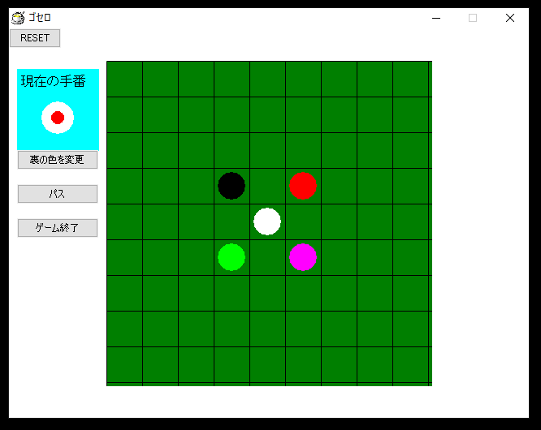

# gothello

撲殺天使ドクロちゃんに登場する「ゴセロ」です。

# 画像

# 最善手

オリジナル版では白先手から最善手を打つと 13-2 で**白が勝ちます**

棋譜（読み方は MEMO 参照）

`[rg]g3;Gh2;Pc3;Wi1;[rgp]g7;Ph8;Bi9;Wc7;Bb2;Wa1;`

後手（色番）はほとんどパスか一通りしか打てず唯一の二択の選択肢を間違えると 15-0 で**完敗します**

`[rg]g3;Gh2;Pc3;Wi1;[rgp]g7;Ph8;Bb2;Wi9;Wa1;Wc7;`

こんなことをしたら撲殺されてしまいそうですが。

ただ適当に打っても割と白が勝つ気がします。

# 台詞

> 「じゃあ桜くんはホワイトね。僕はレッドとグリーンとピンクとブラックと…」[1]

> 「じゃあ桜くんピンクでいいから。」[1]

[1]: おかゆまさき 『撲殺天使ドクロちゃん』 木工ボンド部 2005 第一話 「撲殺天使だよ！ドクロちゃん」 4:50~5:05 [d アニメストア](https://anime.dmkt-sp.jp/animestore/ci_pc?workId=10221&partId=10221001)
